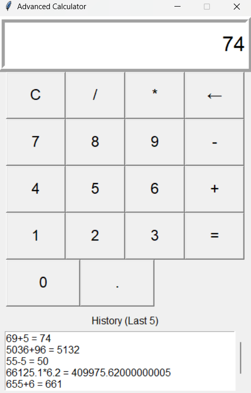

# 🧮tkinter-calculator

This is a feature-rich calculator application built using **Python** and **Tkinter**. It supports basic arithmetic operations, provides keyboard input support, and displays a history of recent calculations.

---

## 🚀 Features

✅ Basic operations: `+`, `-`, `×`, `/`  
✅ Keyboard input support (e.g., type `2+2` and press `Enter`)  
 ✅ Backspace functionality (`←` button or `Backspace` key)  
✅ Clear input with `C`   
✅ Scrollable history of last calculations

---

## 🖼️ Screenshot



---

## 📦 How to Run

1. Make sure you have Python 3 installed.
2. Clone the repository or download the code:
   ```bash
   git clone https://github.com/your-username/tkinter-calculator.git
   cd tkinter-calculator
3. Run the application 
   ```bash
   python calculator.py
